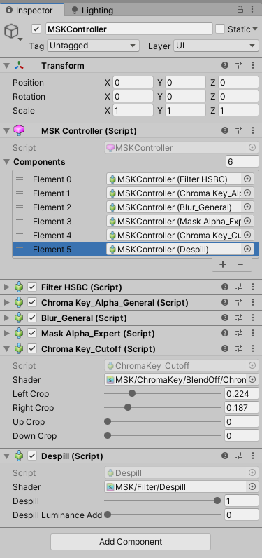

## Chroma-Key-Kit-Improvements

New filers and effects for the [Chroma Key Kit ](https://assetstore.unity.com/packages/tools/particles-effects/chroma-key-kit-71684)

## Filters

* Despill - Simple Despill effect used to remove the saturation of the green outline and shadows when using chroma key.

Despill Off | Despill On | Despill On with Liminance
:-------------------------:|:-------------------------:|:-------------------------:
||

* Crop - Simple Left/Right/Up/Down crop

Crop Off | Crop On
:-------------------------:|:-------------------------:
|

### How To Use

1. But the [Chroma Key Kit ](https://assetstore.unity.com/packages/tools/particles-effects/chroma-key-kit-71684) from the Unity asset store and import.
2. Download the CKK Improvements.unitypackage and import it.
3. Add the desired effect to the MSK Controller.
4. The effectss must come after the Mask effect.
 

